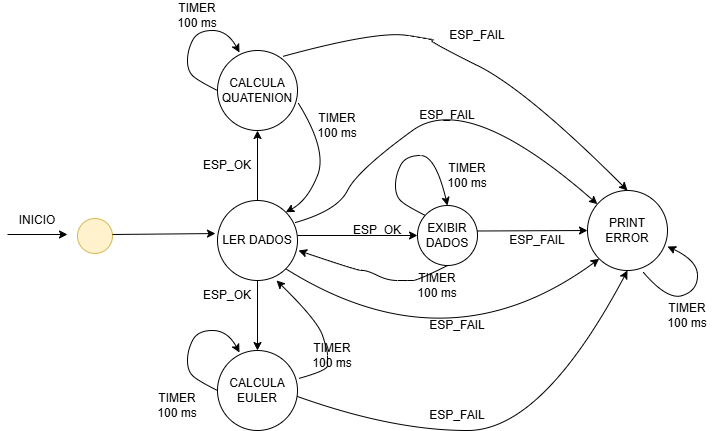
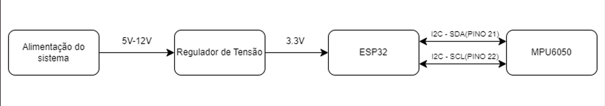
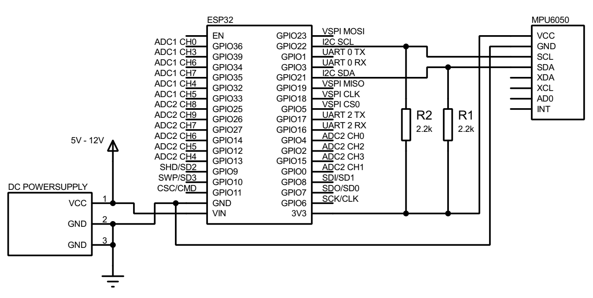
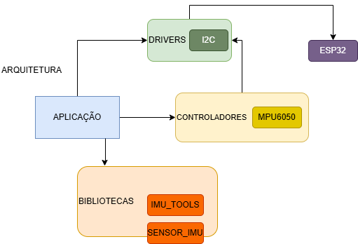

# Projeto feito em conjunto com: 

<div style="display: inline_block;" align="center">

<table>
  <tr>
    <td align="center">
      <a href="https://github.com/MatheusCarne" target="_blank">
        <br>
        <sub>
          <b>Matheus Carneiro</b>
        </sub>
      </a>
    </td>
    <td align="center">
      <a href="https://github.com/RafaelBerg" target="_blank">
        <br>
        <sub>
          <b>Rafael Berg</b>
        </sub>
      </a>
    </td>
    <td align="center">
      <a href="https://github.com/heitorbrunini" target="_blank">
        <br>
        <sub>
          <b>Heitor Brunini</b>
        </sub>
      </a>
    </td>
  </tr>
</table>

</div>

| Placas suportadas | ESP32 | ESP32-C3 | ESP32-C5 | ESP32-C6 | ESP32-C61 | ESP32-H2 | ESP32-S3 |
| ----------------- | ----- | -------- | -------- | -------- | --------- | -------- | -------- |

### Descrição do projeto

Neste repositório foram desenvolvidas duas bibliotecas para utilizar do módulo MPU6050 utilizando das medições do giroscópio e do acelerômetro.

Na biblioteca **sensor_imu** implementa funções para inicializar, ler dados e desinicializar o sensor IMU (MPU6050) usando o protocolo I2C.

```
imu_init(): Inicializa o sensor MPU6050 configurando o driver I2C e verificando se o dispositivo está acessível.

imu_get_acceleration_data: Lê os dados de aceleração do sensor.

imu_get_gyroscope_data: Lê os dados do giroscópio do sensor.

imu_deinit: Desinicializa o driver I2C, liberando os recursos alocados.
```

Na **imu_tools** implementa funções relacionadas à leitura de dados de um sensor IMU (MPU6050), cálculo de quaternions e conversão para ângulos de Euler.  

```
imu_read_data: Lê os dados do acelerômetro e giroscópio do sensor IMU, inicializando a comunicação I2C e coletando as informações necessárias.

imu_calculate_quaternion: Calcula o quaternion que representa a orientação do sensor a partir dos dados de aceleração e giroscópio.

imu_calculate_euler_angles: Converte um quaternion em ângulos de Euler (roll, pitch, yaw), que são mais intuitivos para descrever a orientação de um objeto.

```

# Diagrama de estados
  

# Diagrama de blocos
   

# Esquemático


# Diagrama de arquitetura

