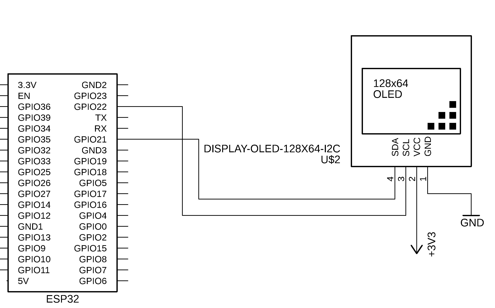

# Projeto feito em conjunto com: 

<div style="display: inline_block;" align="center">

<table>
  <tr>
    <td align="center">
      <a href="https://github.com/MatheusCarne" target="_blank">
        <br>
        <sub>
          <b>Matheus Carneiro</b>
        </sub>
      </a>
    </td>
    <td align="center">
      <a href="https://github.com/RafaelBerg" target="_blank">
        <br>
        <sub>
          <b>Rafael Berg</b>
        </sub>
      </a>
    </td>
    <td align="center">
      <a href="https://github.com/heitorbrunini" target="_blank">
        <br>
        <sub>
          <b>Heitor Brunini</b>
        </sub>
      </a>
    </td>
  </tr>
</table>

</div>

| Placas suportadas | ESP32 | ESP32-C3 | ESP32-C5 | ESP32-C6 | ESP32-C61 | ESP32-H2 | ESP32-S3 |
| ----------------- | ----- | -------- | -------- | -------- | --------- | -------- | -------- |

### Descrição do projeto

Esta biblioteca permite a comunicação com o display OLED SSD1306 via I2C e SPI no ESP32 utilizando o framework ESP-IDF. Suporta exibição de textos e figuras, facilitando a interface gráfica para projetos embarcados.


```
void ssd1306_init( ): Inicializa o display SSD1306.

void ssd1306_draw_string( ): Escreve uma string no display na posição especificada.

void ssd1306_draw_char( ): Desenha um caractere na posição especificada.

void ssd1306_clear( ): Limpa o display e apaga todos os pixels.

void ssd1306_update_screen( ): Atualiza o display para exibir as mudanças feitas no buffer.

ssd1306_draw_rectangle( ): Desenha um retângulo na tela OLED na posição (x, y) com a largura width e altura height.

ssd1306_draw_pixel( ): Define o estado de um único pixel na tela OLED na posição (x, y).
```

# Esquemático

